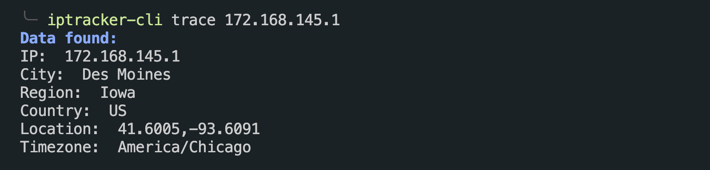
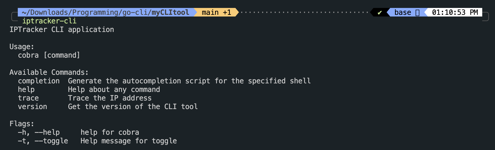

<a name="readme-top"></a>

<!-- PROJECT LOGO -->
<br />
<div align="center">
  <a href="https://github.com/ayushgml/iptracker-cli">
  </a>

  <h1 align="center">IPTracker-CLI</h1>

  <p align="center">
    A Go based IP address tracking tool
    <br />
    <a href="https://github.com/ayushgml/iptracker-cli"><strong>Explore the docs »</strong></a>
    <br />
    <br />
    <a href="https://github.com/ayushgml/iptracker-cli">View Demo</a>
    ·
    <a href="https://github.com/ayushgml/iptracker-cli/issues">Report Bug</a>
    ·
    <a href="https://github.com/ayushgml/iptracker-cli/issues">Request Feature</a>
  </p>
</div>

<!-- ABOUT THE PROJECT -->
## About The Project
<div align="center">
</div>
This is my first GO based CLI project in which you can track the IP address the user enters as an argument in the terminal or any command line interface.

Read the below section to know how to use this tool.

<p align="right">(<a href="#readme-top">back to top</a>)</p>


<!-- GETTING STARTED -->
## How to Install the CLI

Run the following command:

```sh
git clone https://github.com/ayushgml/iptracker-cli.git
cd iptracker-cli
```

Now install the dependencies using the following command:

```sh
go build
go install
```

## Usage

Once you have installed the CLI, you can use it by running the following command:

```sh
iptracker-cli trace <ip-address>
```

to get help, run the following command:

```sh
iptracker-cli
```

For example:



<p align="right">(<a href="#readme-top">back to top</a>)</p>


<!-- CONTACT -->
## Contact

Ayush Gupta - [@itsayush__](https://twitter.com/itsayush__) - ayushgml@gmail.com

Project Link: [https://github.com/ayushgml/iptracker-cli](https://github.com/ayushgml/iptracker-cli)

<p align="right">(<a href="#readme-top">back to top</a>)</p>


